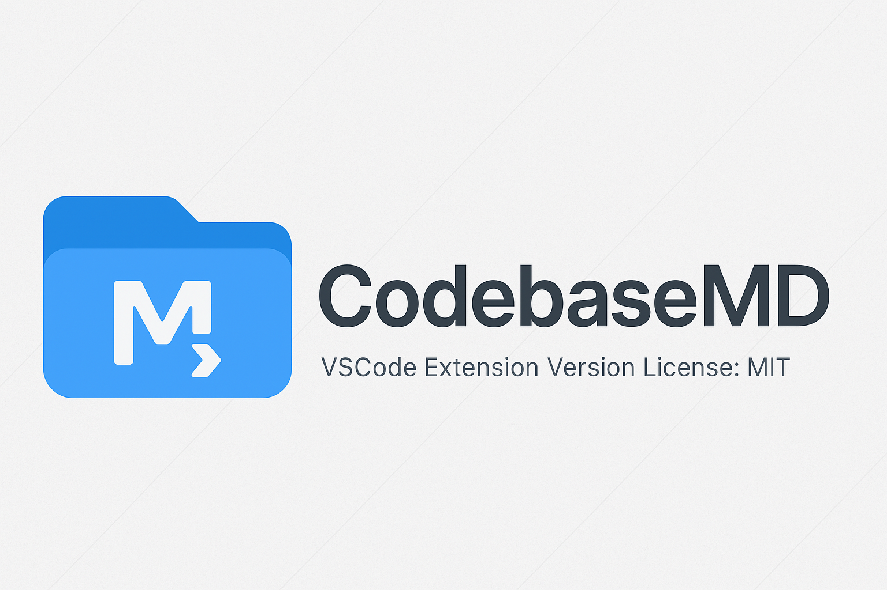

# CodebaseMD



[](https://github.com/alpha912/codebase-md/releases/latest)
[](https://github.com/alpha912/codebase-md/actions/workflows/ci.yml)
[](https://marketplace.visualstudio.com/items?itemName=alpha912.codebase-md)
[](LICENSE.md)

**Prepare code context without leaving VS Code.** Export a workspace, selected files, or Git changes as Markdown, XML, or plain text. Save it, copy it, or open it in an editor.

CodebaseMD runs locally. It does not upload your source code or call an AI provider.

[Install from GitHub Releases](https://github.com/alpha912/codebase-md/releases/latest) · [Documentation](docs/README.md) · [Changelog](docs/changelog.md) · [Report an issue](https://github.com/alpha912/codebase-md/issues)

## Start in a minute

1. Download the `.vsix` from [GitHub Releases](https://github.com/alpha912/codebase-md/releases/latest).
2. In VS Code, open **Extensions → … → Install from VSIX…**, then select the file.
3. Open a local workspace and run **CodebaseMD: Export Wizard** from the Command Palette.
4. Choose your scope, content mode, output format, and destination.

The Marketplace has its own publication schedule; use the GitHub VSIX for this release. VS Code 1.70 or later is required. Git is needed only for Git exports.

## What's new in version 3.0.0

| Capability | What you can do |
| --- | --- |
| Export Wizard | Choose workspace, selected files/folders, Git changes, or current file |
| Output formats | Generate Markdown with a contents list, escaped XML, or plain text |
| Destinations | Save a file, copy to clipboard, or open an editable document |
| Content modes | Include full source, existing Micro summaries, or best-effort skeletons |
| Context budgets | See approximate tokens per file and language; warn before exceeding a budget |
| Git context | Export changes against HEAD, untracked files, and optional filtered diffs |
| Secret redaction | Replace recognizable credentials before exporting; report counts |
| File handling | Respect nested ignore rules, skip symlinks, bound file sizes, and cancel exports |

The four existing commands still save Markdown. Micro retains its established summary format. Read the [v3 release notes](releases/RELEASE-NOTES-3.0.0.md) for migration details.

## Commands

| Command Palette title | Behavior |
| --- | --- |
| **CodebaseMD: Export Wizard** | Four-step export flow |
| **CodebaseMD: Export Git Changes** | Changed files using configured output options |
| **CodebaseMD: Copy Current File** | Copy the active saved file, including unsaved edits |
| **Export Codebase as Markdown** | Full workspace to a Markdown file |
| **Export Selected as Markdown** | Selected files/folders to Markdown |
| **Export Micro Codebase** | Workspace Micro summary to Markdown |
| **Export Selected as Micro Codebase** | Selected Micro summary to Markdown |

The two selected-export commands also appear in the Explorer context menu. From the Command Palette, they open a file/folder picker. Multi-root workspaces prompt for one folder per export.

## Settings

Search for **CodebaseMD** in Settings. All keys below use the `codebaseMD.` prefix and can be configured per workspace folder.

| Setting | Default | Meaning |
| --- | --- | --- |
| `format` | `markdown` | `markdown`, `xml`, or `text` |
| `contentMode` | `full` | `full`, `micro`, or `skeleton` |
| `target` | `file` | `file`, `clipboard`, or `editor` |
| `tokenBudget` | `32000` | Warning threshold; `0` disables warnings |
| `redactSecrets` | `true` | Heuristic redaction of recognizable secrets |
| `maxFileSizeKB` | `1024` | Maximum content/diff size per file in KiB |
| `exclude` | `[]` | Additional gitignore-style exclusions |
| `respectGitignore` | `true` | Apply root and nested `.gitignore` rules |
| `includeDiff` | `false` | Add tracked-file diffs to Git exports |
| `lineNumbers` | `false` | Number lines in the exported representation |
| `customHeader` | empty | Add your task or instructions |

The wizard starts from these defaults. Original commands retain their full/Micro and Markdown-to-file behavior; Copy Current File always uses the clipboard.

## Choose what is shared

- **`.gitignore` and `exclude`** remove matching files entirely, including their paths.
- **`.codebaseignore`** in the workspace root hides matching contents but retains paths in the tree.
- **Default exclusions** skip dependency/build directories, lockfiles, archives, and default `codebase-export.*` output names.
- **Size and binary checks** replace unavailable content with an omission notice. Symbolic links and junctions are skipped.

These rules also apply to explicit selections. See [configuration examples](docs/configuration.md).

## Accuracy and scope

**Token estimates** use `ceil(characters / 4)`, not a model tokenizer. File statistics cover transformed content. The budget warning covers the entire formatted output, including headers and diffs. Actual model usage can differ substantially.

**Micro and skeleton modes** use heuristics, not complete language parsers. Skeletons may miss multiline declarations or misidentify signatures; files without recognized declarations retain full content. Line numbers in condensed modes refer to the exported representation.

**Secret redaction** recognizes common provider tokens, JWTs, private keys, and password/token assignments. It can miss secrets or redact ordinary values. Review exports before sharing them. Paths remain visible unless excluded; redaction reports contain counts, not matched values.

**Git exports** use disk/index changes against HEAD to select files. Buffer-only edits do not add files to this scope, although selected open files use editor content. Diffs reflect disk/index state, omit deleted/excluded/unavailable contents, and do not include untracked-file patches. Deleted paths remain listed. Repositories without commits are supported. Git exports require workspace trust.

**Local workspaces** are supported, one folder per export. Virtual filesystem workspaces and untitled files are not supported.

## Development

Use Node.js 22.12+ (Node 24 recommended) and Git:

```sh
npm ci
npm test
npm run test:integration
npm run package
```

Unit tests import production modules and create temporary Git repositories. Integration tests launch a VS Code host and verify commands, clipboard output, and unsaved content. Linux integration tests require a display (`xvfb-run -a npm run test:integration` in CI). The CI workflow tests Windows and Linux and retains the built VSIX as an artifact.

See [contributing](CONTRIBUTING.md), the [developer module reference](docs/api-reference.md), and the [research and implementation plan](docs/v3-plan.md). The separate [web prototype](CodebaseMD-Web/README.md) is not part of this extension release.

## License

[MIT](LICENSE.md) · Created by [Alphin Tom](https://github.com/alpha912).
